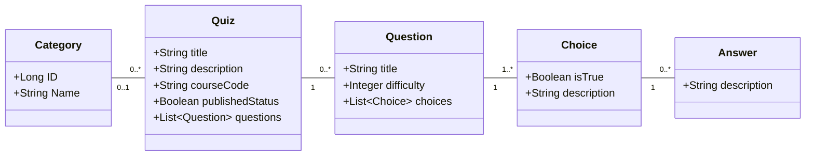

# Quizzer
## Description
Working as a four man team in a project called Quizzer. The project lasts 6 weeks so three two week Sprints.

**More about the project**

### Team members
* [Jarno Ryhänen](https://github.com/JarnoRyhanen)
* [Matti Pohjanoksa](https://github.com/MatPohj)
* [Valtteri Vuokila](https://github.com/Valheri)
* [Ville Stolt](https://github.com/Vsto99)
  
### Backlog
[Link to the Backlog](https://github.com/orgs/FullFlip/projects/1)

### Data diagram

### Instructions
#### Basic setup
1. Clone the repository
 ```
git clone https://github.com/FullFlip/Quizzer.git
 ```
2. Go to the folder
 ```
cd Quizzer
 ```
3. Open the application to VScode.
 ```
code .
 ```
If that didn't work just open the Quizzer folder inside ur preferred IDE

4. Run the application from the __QuizzerApplication.java__ file or start the program from Spring boot dashboard
5. Go to front end folder
 ```
cd Frontend
 ```
6. Install dependencies
 ```
npm install
 ```
7. After they are installed you can start the front end
 ```
npm run dev
 ```
8. The output is probably something like
 ```

  VITE v6.2.4  ready in 620 ms

  ➜  Local:   http://localhost:5173/
  ➜  Network: use --host to expose
  ➜  press h + enter to show help
 ```
9. Go to the link and enjoy

