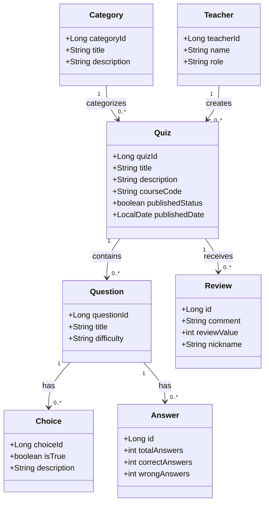

# Heroku Deployment Information

## Single Deployment Setup
This branch is configured for Heroku single deployment, where the frontend is built and served through the backend's static folder. This approach simplifies deployment by requiring only one Heroku dyno instead of separate deployments for frontend and backend.

## Teacher Access
The application uses a "secret link" approach to access the teacher view:

- The secret link is defined in the `Frontend/.env` file as `VITE_SECRET_LINK`
- To access the teacher view, navigate to `http://localhost:5173/{secret-link}`
- In a production environment, you should:
  - Keep this link confidential
  - Change the value from the default
  - Ensure `.env` is in your `.gitignore` (it's already included but kept in the repo for demonstration)

> ⚠️ **Security Note**: For a real production application, this should be replaced with proper authentication. The secret link approach is used here for demonstration purposes only.

# Description
Working as a four man team in a project called Quizzer. The project lasts six weeks so three two week Sprints. In releases there is a release for each Sprint. 

Quizzer is a full-stack web application for creating, managing, and taking quizzes. It features a React + TypeScript frontend with Tailwind CSS for styling, and a Java Spring Boot backend with a REST API and H2 database. Teachers can create, edit, categorize, and publish quizzes, while students can browse and complete published quizzes by category.

# Team members
* [Jarno Ryhänen](https://github.com/JarnoRyhanen)
* [Matti Pohjanoksa](https://github.com/MatPohj)
* [Valtteri Vuokila](https://github.com/Valheri)
* [Ville Stolt](https://github.com/Vsto99)
  
# Backlog
[Link to the Backlog](https://github.com/orgs/FullFlip/projects/1)

# Technologies used in this project
## Backend
- Programming Language: Java ( 17 ) 
- Framework: Spring boot
- In development H2 Database
- In production xx
## Frontend
- Programming Language: TypeScript
- Framework: React
- Build Tool: Vite
- Styling: Tailwind CSS
  
Major Libraries used in the Frontend:
   - React Router Dom
   - Tailwind

# Data diagram

# Instructions
## Basic setup
1. Clone the repository
 ```
git clone https://github.com/FullFlip/Quizzer.git
 ```
2. Go to the folder
 ```
cd Quizzer
 ```
3. Open the application to VScode.
 ```
code .
 ```
If that didn't work just open the Quizzer folder inside ur preferred IDE

4. Run the application from the __QuizzerApplication.java__ file or start the program from Spring boot dashboard
5. Go to front end folder
 ```
cd Frontend
 ```
6. Install dependencies
 ```
npm install
 ```
7. After they are installed you can start the front end
 ```
npm run dev
 ```
8. The output is probably something like
 ```

  VITE v6.2.4  ready in 620 ms

  ➜  Local:   http://localhost:5173/
  ➜  Network: use --host to expose
  ➜  press h + enter to show help
 ```
9. Go to the link and enjoy

10. For API documentation go to http://localhost:8080/swagger-ui/index.html  after sucesfully starting Spring Boot
