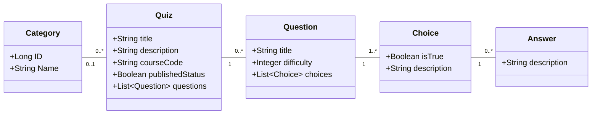

# Quizzer
## Description
Working as a four man team in a project called Quizzer. The project lasts 6 weeks so three two week Sprints.

**More about the project**

### Team members
* [Jarno Ryhänen](https://github.com/JarnoRyhanen)
* [Matti Pohjanoksa](https://github.com/MatPohj)
* [Valtteri Vuokila](https://github.com/Valheri)
* [Ville Stolt](https://github.com/Vsto99)
  
### Backlog
[Link to the Backlog](https://github.com/orgs/FullFlip/projects/1)

### Data diagram

